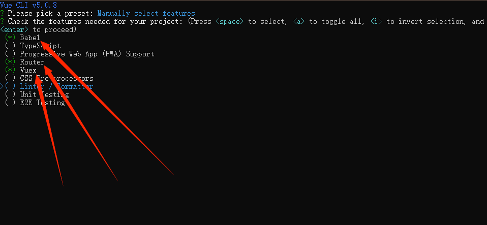
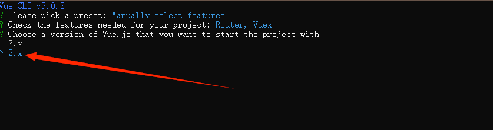
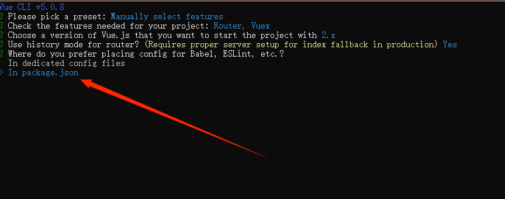
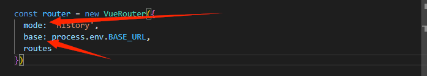
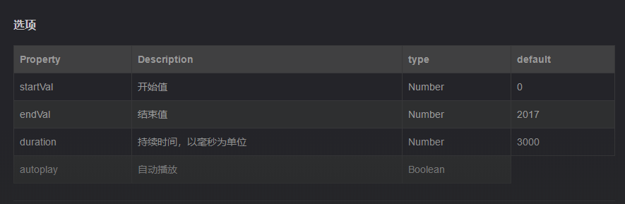

[toc]

# 1.创建vue项目

！！！node版本是16.18

 1.使用 vue create vue-project 创建项目

   ```
   如果提示'vue' 不是内部或外部命令，也不是可运行的程序，先下载脚手架 npm install -g @vue/cli
   ```

2.选择第三个自选


3.选择Babel，Router和Vuex



4.选择vue2



5.选择In package.json




6.安装依赖

```
npm i -S element-ui@2.15.5
npm i -D sass@1.26.5
npm i -D sass-loader@8.0.2
```

# 2.引入element-ui

1.在main.js文件引入element-ui

```js
import App from './App.vue'
import ElementUI from 'element-ui'
import 'element-ui/lib/theme-chalk/index.css'

Vue.use(ElementUI)
```

# 3.配置路由

1.先把app.vue的默认代码删除，留下一个router-view路由出口

```html
<template>
 
    <router-view/>

</template>

```

2.打开router文件夹下的index.js，删除掉默认的路由配置

​    删掉mode和base



3.先在view文件夹下创建Login.vue，然后添加一个登录页面的路由和重定向

```js
const routes = [
    {
    path:'/',
    redirect:'/login'
  },
  {
    path: '/login',
    name: 'Login',
    component: () => import('../views/Login.vue')
  },
]
```


# 4.编写登录页面

第一步

```html
<div class="login-box">
    <div class="login-input-box center">
      <h1>信贷管理系统</h1>
    
    </div>
  </div>
```

第二步

先定义表单内容放到--上面的h1标签下面

```html
<el-form :model="ruleForm" :rules="rules" status-icon ref="ruleForm" class="demo-ruleForm">
    
        <el-form-item prop="username">
          <el-input prefix-icon="el-icon-user-solid" v-model="ruleForm.username"></el-input>
        </el-form-item>
    
        <el-form-item prop="pass">
          <el-input prefix-icon="el-icon-s-order" type="password" v-model="ruleForm.pass" autocomplete="off"></el-input>
        </el-form-item>

        <el-button type="primary" @click="submitForm">提交</el-button>
      </el-form>
```


第三步

1.data中定义一个ruleForm，接收用户名和密码

2.再定义一个rules，限制输入格式

3.在methods中添加一个submitForm表单提交方法和密码限制的validatePass方法

data中：

```js
ruleForm: {
                username: "",
                pass: ""
}
```

```js
rules: {
        pass: [
          {
            validator: this.validatePass,
            trigger: "blur"
          }
        ],
        username: [{ required: true, trigger: "blur", message: "请输入用户名" }]
      }
```

methods中：

```js
validatePass(rule, value, callback) {
      if (value === "") {
        callback(new Error("请输入密码"));
      } else if (value.length < 6) {
        callback(new Error("密码不能小于6位数"));
      } else {
        callback();
      }
    },
 submitForm(){
 this.$refs.ruleForm.validate(valid => {
        if (valid) {
          // 如果验证通过，
         //调用login方法，传入登录信息，下面会定义
         this.login(this.ruleForm)
        } else {
         
          return false;
        }
      });
  }
```

4.创建login登录方法

```js
async login(form){
    //成功后跳转到首页
     this.$router.replace("/home");
}
```

5.样式的引入

1.把课件中的normalize.css和bg2.jpg放到assets文件夹中

2.然后在main.js中引入样式

```js
 import '@/assets/normalize.css';
```

3.在登录界面中引入下面样式

！！！注意语言是scss

```css
<style lang="scss" scoped>
.login-input-box {
  width: 650px;
  height: 320px;
  background: #fff;
  text-align: center;
  padding: 40px 40px 12px 12px;
}

.login-box {
  height: 100%;
  background: url(../assets/bg2.jpg);
  background-size: cover;
}

.el-button {
  width: 600px;
}

.el-input {
  width: 600px;
  margin-bottom: 16px;
}

::v-deep .el-input__inner {
  background: #e5e5e5;
}
</style>
```

# 5.编写首页

1.添加路由规则

打开router文件夹下的index.js

其中的Layout为布局页面

```js
//为routes添加
{
    path: '/',
    redirect:'/home',
        //下面这两个页面按照层级自行创建
    component:()=>  import('@/layout/layout.vue'),
    children:[
      {
      meta:{
       title:'首页'
        },
        path:'/home',
        component:()=> import('@/views/home.vue')
      }
    ]
  }
```

2.创建layout布局页面和home页面

3.编写layout页面

```html
//html代码
<template>
    <el-container>
        <el-aside width="240px">
          
        </el-aside>
        <el-container>
            <el-header>
               

            </el-header>
            <el-main>
                
               
                
            </el-main>
         
        </el-container>
    </el-container>
</template> 
```

4.先编写左侧菜单

```html
 <el-aside width="240px">
            <el-menu   class="el-menu-vertical-demo" background-color="#545c64"
                text-color="#fff" active-text-color="#ffd04b">
                <!--//没有二级导航的 -->
                 <el-menu-item index="1">
                    <span slot="title"> 首页</span>
                 </el-menu-item>
                
			 <!--	//有二级导航的 -->
                <el-submenu index="2">
                        <template slot="title">
                        <span>贷款管理</span>
                        </template>
                      <el-menu-item index="2-1">
                         贷款申请
                      </el-menu-item>
                </el-submenu>   
                
            </el-menu>

</el-aside>
```

5.编写头部导航区

```html
 <el-header>
               <!--//左侧面包屑-->
               <div class="left">
                   首页
                </div>
     			<!--//右侧用户名-->
                <div class="right">
                   <!--// //下拉菜单-->
                   <el-dropdown >
                       
                    <span class="el-dropdown-link"> admin </span>
                       
                    <el-dropdown-menu slot="dropdown">
                        <el-dropdown-item >退出登录</el-dropdown-item>
                    </el-dropdown-menu>
                       
                  </el-dropdown>
                </div>
 </el-header>
```

6.展示主页面

```html
<el-main>
                <!-- //放置一个路由出口 -->
                <router-view />
                
</el-main>
```

7.编写home页面

```html
<template>
  <div>
    我是home页面
  </div>
</template>
```

8.引入css样式

```css
<style scoped>
a:link {
  text-decoration: none;
  color: #fff;

}

/* 状态二: 已经访问过的链接 */
a:visited {
  text-decoration: none;
  color: #fff;
}

/* 状态三: 鼠标划过(停留)的链接(默认红色) */
a:hover {
  text-decoration: none;
  color: #fff;
}
/* 状态四: 被点击的链接 */
a:active {
  text-decoration: none;
  color: #fff;
}
.el-header {
    display: flex;
    align-items: center;
    justify-content: space-between;
}

.el-footer {
    background-color: #B3C0D1;
    color: #333;
    text-align: center;
    line-height: 60px;
}

.el-aside {
    background-color: #545c64;
    color: #333;
    text-align: center;
    line-height: 200px;
}

.el-main {
    background-color: #E9EEF3;
    color: #333;
    text-align: center;
}

.el-container {
    height: 100%;
}
.el-menu-vertical-demo {
    border:none;
}
</style>
```

# 6编写home页面

1.主要是写一个数字滚动，和3个echarts图表

```html
<template>
  <div class="home">
    
  </div>
</template>
```

2.设置3个栅格布局，其中属性作用，查看element-ui官网的layout布局

```html
 <div class="home">
    <el-row :gutter="10">
            <el-col :xl="6" :lg="6" :md="12" :sm="24" :xs="24" >
            <div>1</div>
            </el-col>
            <el-col :xl="6" :lg="6" :md="12" :sm="24" :xs="24" >
            <div>2</div>
            </el-col>
            <el-col :xl="6" :lg="6" :md="12" :sm="24" :xs="24" >
            <div>3</div>
        </el-col>
    </el-row>
</div>
```

3.把栅格布局的内容使用数组遍历来显示

1.data中定义一个数组

```js
 data(){
        return {
            list: [
                { val: 13594, title: '最高可借金额', color: '#67ca3a', },
                { val: 9833, title: '回报率', color: '#ff6600' },
                { val: 8888, title: '业绩领跑', color: '#f56c6c' },
                { val: 6666, title: '安稳底薪战队', color: '#409eff' }
             ]
        }
    }
```

4.改写栅格布局

```html
 <el-row :gutter="10">
      <el-col :xl="6" :lg="6" :md="12" :sm="24" :xs="24" v-for="(item, index) in list"          :key="index">
          
        <div class="dashboard-item" :style="{ background: item.color }">
          <p>{{ item.title }}</p>
            
        </div>
      </el-col>
    </el-row>
```

5.介绍数字滚动插件vue-count-to

官网：https://www.npmjs.com/package/vue-count-to

使用说明，是一个组件，引入后插入页面使用

属性说明



6.下载vue-count-to

```js
npm i -S vue-count-to@1.0.13
```

7.引入并使用

引入

```js
import CountTo from 'vue-count-to'
```

注册

```js
 components:{
        CountTo
    }
```

使用

```html
<el-col :xl="6" :lg="6" :md="12" :sm="24" :xs="24" v-for="(item, index) in list" :key="index">
        <div class="dashboard-item" :style="{ background: item.color }">
          <p>{{ item.title }}</p>

          <!--放到栅格布局的里面 startVal是开始的值 endVal是结束的值，duration是持续的时长毫秒为单位  -->
          <CountTo :startVal="0" :endVal="item.val" :duration="3000" />
        </div>
      </el-col>
```

8.介绍echart

官网https://echarts.apache.org/zh/index.html

9.下载echarts并使用

下载

```js
npm i -S echarts@4.9.0
```

home页面引入

```js
import echarts from 'echarts';
```

##6.1.编写第一个图表

1.定义图表位置

```html
<template>
    <div class="home">
     <el-row :gutter="10">
          <el-col :xl="6" :lg="6" :md="12" :sm="24" :xs="24" v-for="(item, index) in             list"  :key="index">
              
            <div class="dashboard-item" :style="{ background: item.color }">
              <p>{{ item.title }}</p>
              <CountTo :startVal="0" :endVal="item.val" :duration="3000" />
            </div>
          </el-col>
        </el-row>
        
		<!-- 所有图表位置，一共3个 -->
    <div class="echarts-box">
        <!-- 第一个图表位置-->
      <div class="chart1"></div>

    </div>


    </div>
  </template>
```

2.配置图表

添加一个initCharts方法

```js
 initCharts() {
     //初始化图表实例，为什么要添加到this上面，因为后面要检测页面大小改变，更新图表大小
      this.chart1 = echarts.init(document.querySelector('.chart1'));
     //图表配置，复制就是
     let option1 = {
        title: {
   
        },
        tooltip: {
          trigger: 'axis'
        },
        legend: {
          data: ['Email', 'Union Ads', 'Video Ads', 'Direct', 'Search Engine']
        },
        grid: {
          left: '3%',
          right: '4%',
          bottom: '3%',
          containLabel: true
        },
        toolbox: {
          feature: {
            saveAsImage: {}
          }
        },
        xAxis: {
          type: 'category',
          boundaryGap: false,
          data: ['Mon', 'Tue', 'Wed', 'Thu', 'Fri', 'Sat', 'Sun']
        },
        yAxis: {
          type: 'value'
        },
        series: [
          {
            name: 'Email',
            type: 'line',
            stack: 'Total',
            data: [120, 132, 101, 134, 90, 230, 210]
          },
          {
            name: 'Union Ads',
            type: 'line',
            stack: 'Total',
            data: [220, 182, 191, 234, 290, 330, 310]
          },
          {
            name: 'Video Ads',
            type: 'line',
            stack: 'Total',
            data: [150, 232, 201, 154, 190, 330, 410]
          },
          {
            name: 'Direct',
            type: 'line',
            stack: 'Total',
            data: [320, 332, 301, 334, 390, 330, 320]
          },
          {
            name: 'Search Engine',
            type: 'line',
            stack: 'Total',
            data: [820, 932, 901, 934, 1290, 1330, 1320]
          }
        ]
      }
     
     //应用配置生成图表
      this.chart1.setOption(option1)
 }
```

3.在mounted生命周期里执行initCharts方法

```js
mounted() {
    this.initCharts()
 }
```

4.图表没有显示

需要设置容器大小

```css
 .chart1 {
    width: 100%;
    height: 400px;
  }
```

##6.2.编写第二个图表

1.

```html
	<!-- 放在第一个图表下面     --> 
<div class="chart2"></div>
```

2.在initCharts方法中编写第二个图表数据

```js
     this.chart2 = echarts.init(document.querySelector('.chart2'));
		//下面都是图表的配置，顺序不能错
    
      let posList = [
        'left',
        'right',
        'top',
        'bottom',
        'inside',
        'insideTop',
        'insideLeft',
        'insideRight',
        'insideBottom',
        'insideTopLeft',
        'insideTopRight',
        'insideBottomLeft',
        'insideBottomRight'
      ];
      let app = {};

      app.configParameters = {
        rotate: {
          min: -90,
          max: 90
        },
        align: {
          options: {
            left: 'left',
            center: 'center',
            right: 'right'
          }
        },
        verticalAlign: {
          options: {
            top: 'top',
            middle: 'middle',
            bottom: 'bottom'
          }
        },
        position: {
          options: posList.reduce(function (map, pos) {
            map[pos] = pos;
            return map;
          }, {})
        },
        distance: {
          min: 0,
          max: 100
        }
      };
      app.config = {
        rotate: 90,
        align: 'left',
        verticalAlign: 'middle',
        position: 'insideBottom',
        distance: 15,
        onChange: function () {
          const labelOption = {
            rotate: app.config.rotate,
            align: app.config.align,
            verticalAlign: app.config.verticalAlign,
            position: app.config.position,
            distance: app.config.distance
          };
          this.chart2.setOption({
            series: [
              {
                label: labelOption
              },
              {
                label: labelOption
              },
              {
                label: labelOption
              },
              {
                label: labelOption
              }
            ]
          });
        }
      };
      const labelOption = {
        show: true,
        position: app.config.position,
        distance: app.config.distance,
        align: app.config.align,
        verticalAlign: app.config.verticalAlign,
        rotate: app.config.rotate,
        formatter: '{c}  {name|{a}}',
        fontSize: 16,
        rich: {
          name: {}
        }
      };
      let option2 = {
        tooltip: {
          trigger: 'axis',
          axisPointer: {
            type: 'shadow'
          }
        },
        legend: {
          data: ['Forest', 'Steppe', 'Desert', 'Wetland']
        },
        toolbox: {
          show: true,
          orient: 'vertical',
          left: 'right',
          top: 'center',
          feature: {
            mark: { show: true },
            dataView: { show: true, readOnly: false },
            magicType: { show: true, type: ['line', 'bar', 'stack'] },
            restore: { show: true },
            saveAsImage: { show: true }
          }
        },
        xAxis: [
          {
            type: 'category',
            axisTick: { show: false },
            data: ['2012', '2013', '2014', '2015', '2016']
          }
        ],
        yAxis: [
          {
            type: 'value'
          }
        ],
        series: [
          {
            name: 'Forest',
            type: 'bar',
            barGap: 0,
            label: labelOption,
            emphasis: {
              focus: 'series'
            },
            data: [320, 332, 301, 334, 390]
          },
          {
            name: 'Steppe',
            type: 'bar',
            label: labelOption,
            emphasis: {
              focus: 'series'
            },
            data: [220, 182, 191, 234, 290]
          },
          {
            name: 'Desert',
            type: 'bar',
            label: labelOption,
            emphasis: {
              focus: 'series'
            },
            data: [150, 232, 201, 154, 190]
          },
          {
            name: 'Wetland',
            type: 'bar',
            label: labelOption,
            emphasis: {
              focus: 'series'
            },
            data: [98, 77, 101, 99, 40]
          }
        ]
      };
      
      this.chart2.setOption(option2);
```

3.设置第二个图表的容器大小

```css
.chart2 {
    height: 400px;
    width: 50%;
  }
```

##6.3第三个图表

1.

```html
      <!--放到第二个图表下面 -->
<div class="chart3"></div>
```

2.配置第三个图表信息

```js
      this.chart3 = echarts.init(document.querySelector('.chart3'));
    let option3  = {
        angleAxis: {},
        radiusAxis: {
          type: 'category',
          data: ['Mon', 'Tue', 'Wed', 'Thu'],
          z: 10
        },
        polar: {},
        series: [
          {
            type: 'bar',
            data: [1, 2, 3, 4],
            coordinateSystem: 'polar',
            name: 'A',
            stack: 'a',
            emphasis: {
              focus: 'series'
            }
          },
          {
            type: 'bar',
            data: [2, 4, 6, 8],
            coordinateSystem: 'polar',
            name: 'B',
            stack: 'a',
            emphasis: {
              focus: 'series'
            }
          },
          {
            type: 'bar',
            data: [1, 2, 3, 4],
            coordinateSystem: 'polar',
            name: 'C',
            stack: 'a',
            emphasis: {
              focus: 'series'
            }
          }
        ],
        legend: {
          show: true,
          data: ['A', 'B', 'C']
        }
      }
      this.chart3.setOption(option3); 

```

3.设置css样式

```css
 .chart3 {
    height: 400px;
    width: 50%;
  }
```


## 6.4监听window窗口大小改变echarts

1.创建resize方法

```js
resize(){
    //resize方法改变图表尺寸
      this.chart1.resize();
      this.chart2.resize();
      this.chart3.resize();
}
```

2.在mounted生命周期设置监听

```js
mounted() {
    this.initCharts()
   	//防止resize方法的this发生改变
    this.resizeCallback = this.resize.bind(this)
    //为window设置监听事件，回调是绑定this的resizeCallback事件
    window.addEventListener('resize', this.resizeCallback)
  },
```


## 6.5引入css样式

把前面写的三个图表的样式覆盖掉

```css
<style lang="scss" scoped>
.dashboard-item {
  height: 200px;
  line-height: 100px;
  font-weight: bold;
  color: #fff;

  >p {
    color: black;
    height: 40px;
    margin: 0;
  }
}

.echarts-box {
  .chart1 {
    width: 100%;
    height: 400px;
  }

  .chart3,
  .chart2 {
    height: 400px;
    width: 50%;
  }

  .chart2 {
    float: left;
  }

  .chart3 {
    float: right
  }

  overflow: hidden;
}
</style>

```

# 7.编写贷款申请页

1.添加一级路由，

```js
 {
    path: "/loan-input",
    component: ()=>  import('@/layout/layout.vue'),
    redirect: "/loan-input/index",
    meta: {
      title: "贷款管理"
    },
    children: [
      {
        path: "/loan-input/index",
        component: ()=> import("@/views/loan-input/index.vue"),
        name: "loan-input",
         meta: {
          title: "贷款申请"
        }
      }
    ]
  }
```

2.创建贷款申请页面

在views下面创建loan-input文件夹，在loan-input文件夹中创建index.vue文件

3.在layout页面菜单中配置--点击路由跳转

```html
<el-submenu index="2">
                        <template slot="title">
                        <span>贷款管理</span>
                        </template>
                      <el-menu-item index="2-1">
                        <router-link to='/loan-input/index'>贷款申请</router-link>
                      </el-menu-item>
                </el-submenu>  
```

4.贷款申请的样式会颜色，如果想重置，可以在layout页面的css添加下面的样式

```css
a:link {
  text-decoration: none;
  color: #fff;

}

/* 状态二: 已经访问过的链接 */
a:visited {
  text-decoration: none;
  color: #fff;
}

/* 状态三: 鼠标划过(停留)的链接(默认红色) */
a:hover {
  text-decoration: none;
  color: #fff;

}
/* 状态四: 被点击的链接 */
a:active {
  text-decoration: none;
  color: #fff;
}

```

## 7.1构建贷款申请页

1.点击菜单看路由地址是否改变

2.打开loan-input下面的index.vue，编写页面

```html
<template>
  <div class="form-box">     <!-- model接收表单数据对象 -->
    <el-form ref="form" :model="form"  label-width="80px">
       
</el-form>
  </div>
</template>
```

3.创建form对象

```js
data(){
    return {
        form:{
            
        }
    }
}
```

###7.1.1.使用card布局，放到el-form里面

```html
<el-card class="box-card">
        <div slot="header">
            <span>个人基本信息</span>
        </div>
         
</el-card>
```

5.使用栅格布局

```html
<el-card class="box-card">
        <div slot="header">
            <span>个人基本信息</span>
        </div>
    	
        <el-row> 
               <el-col
                    :xl='8' :lg='8'
                    :md="12" :sm="24" :xs="24" >
                						<!-- prop的值是下面form后面的属性名也就是name -->
                    <el-form-item label="姓名" prop="name">
                                            <!-- 等所有表单写完统一设置属性接收-->
                        <el-input  type='input' v-model="form.name" ></el-input>
                    </el-form-item>
                </el-col>  
            
            
        </el-row>      
    
    
    </el-card> 
```

6.下面三个el-col都是放到el-row里面的

```html
<el-col
        :xl='8' :lg='8'
        :md="12" :sm="24" :xs="24">
    <el-form-item label="出生日期" prop="birthday">
        <!-- 宽度会有点小，后面复制样式后会改变 -->
        <el-date-picker
                        v-model="form.birthday"
                        type="date"
                        placeholder="选择日期">
        </el-date-picker>
    </el-form-item>
</el-col>  

<el-col
        :xl='8' :lg='8'
        :md="12" :sm="24" :xs="24">
    <el-form-item label="性别" prop="sex">
        <el-select  v-model="form.sex" >
            <el-option
                       key="man"
                       label="男"
                       value="man">
            </el-option>
            <el-option
                       key="woman"
                       label="女"
                       value="woman">
            </el-option>
        </el-select>
    </el-form-item>
</el-col>   

<el-col
        :xl='8' :lg='8'
        :md="12" :sm="24" :xs="24">
    <el-form-item label="身份证" prop="identity_card">
        <el-input  type='input' v-model="form.identity_card" ></el-input>
    </el-form-item>
</el-col>
```

7.添加第二个el-row

在第一个el-row下面添加

```html
 <el-row>
            <el-col
                    :xl='8' :lg='8'
                    :md="12" :sm="24" :xs="24">
                    <el-form-item label="婚姻状态" prop="marriage">
                        <el-select  v-model="form.marriage" >
                       <el-option
                                key="married"
                                label="已婚"
                                value="married">
                        </el-option>
                        <el-option
                                key="unmarried"
                                label="未婚"
                                value="unmarried">
                        </el-option>
                    </el-select>
                    </el-form-item>
                </el-col>   
        </el-row>   
```

8.添加在第二个el-row里面

```html

  <el-col
          :xl='8' :lg='8'
          :md="12" :sm="24" :xs="24">
      <el-form-item label="教育程度" prop="education">
          <el-select  v-model="form.education" >
              <el-option
                         key="college"
                         label="大学"
                         value="college">
              </el-option>
              <el-option
                         key="highschool"
                         label="高中"
                         value="highschool">
              </el-option>
          </el-select>
      </el-form-item>
</el-col> 
<el-col
        :xl='8' :lg='8'
        :md="12" :sm="24" :xs="24" >
    <el-form-item label="居住地址" prop="address1">
        <el-input  type='input' v-model="form.address1" ></el-input>
    </el-form-item>
</el-col>  
```

9.添加第三个el-row

```html
  <el-row>
             <el-col
                    :xl='8' :lg='8'
                    :md="12" :sm="24" :xs="24" >
                    <el-form-item label="户籍地址" prop="address2">
                        <el-input  type='input' v-model="form.address2" ></el-input>
                    </el-form-item>
                </el-col>  
                <el-col
                    :xl='8' :lg='8'
                    :md="12" :sm="24" :xs="24" >
                    <el-form-item label="居住电话" prop="phone">
                        <el-input  type='input' v-model="form.phone" ></el-input>
                    </el-form-item>
                </el-col>  
                <el-col
                    :xl='8' :lg='8'
                    :md="12" :sm="24" :xs="24" >
                    <el-form-item label="手机号" prop="mobile_phone">
                        <el-input  type='input' v-model="form.mobile_phone" ></el-input>
                    </el-form-item>
                </el-col>  
        </el-row> 
```

###7.1.2第二个card，职业信息

1.添加第二个card

```html
<el-card class="box-card">
        <div slot="header">
            <span>职业信息</span>
        </div>
        <el-row> 
            <el-col
                    :xl='8' :lg='6'
                    :md="12" :sm="24" :xs="24" >
                    <el-form-item label="现职公司" prop="company">
                        <el-input  type='input' v-model="form.company" ></el-input>
                    </el-form-item>
            </el-col>

                <el-col
                    :xl='8' :lg='6'
                    :md="12" :sm="24" :xs="24" >
                    <el-form-item label="所属行业" prop="trade">
                        <el-select  placeholder='请选择Green'  v-model="form.trade" >
                       <el-option
                                key="education"
                                label="教育"
                                value="education">
                        </el-option>
                        <el-option
                                key="finance"
                                label="金融"
                                value="finance">
                        </el-option>
                    </el-select>
                    </el-form-item>
             </el-col> 
             <el-col
                    :xl='8' :lg='6'
                    :md="12" :sm="24" :xs="24" >
                    <el-form-item label="职位" prop="position">
                        <el-input  type='input' v-model="form.position" ></el-input>
                    </el-form-item>
                </el-col>   
             <el-col
                    :xl='8' :lg='6'
                    :md="12" :sm="24" :xs="24" >
                    <el-form-item label="公司地址" prop="address3">
                        <el-input  type='input' v-model="form.address3" ></el-input>
                    </el-form-item>
                </el-col>   
        </el-row>   
        
        <el-row>
            <el-col
                    :xl='8' :lg='8'
                    :md="12" :sm="24" :xs="24" >
                    <el-form-item label="公司类型" prop="company_type">
                        <el-input  type='input' v-model="form.company_type" ></el-input>
                    </el-form-item>
            </el-col>
            <el-col
                    :xl='8' :lg='8'
                    :md="12" :sm="24" :xs="24" >
                    <el-form-item label="公司邮箱" prop="company_email">
                        <el-input  type='input' v-model="form.company_email" ></el-input>
                    </el-form-item>
            </el-col>
            <el-col
                    :xl='8' :lg='8'
                    :md="12" :sm="24" :xs="24">
                    <el-form-item label="公司电话" prop="company_phone">
                        <el-input  type='input' v-model="form.company_phone" ></el-input>
                    </el-form-item>
            </el-col>
        </el-row>
    </el-card>
```

### 7.1.3第三个card，收支情况

```html
<el-card class="box-card">
        <div slot="header">
            <span>收支情况</span>
        </div>
        <el-row> 
            <el-col
                    :xl='8' :lg='12'
                    :md="12" :sm="24" :xs="24" >
                    <el-form-item label="收支情况" prop="income">
                        <el-input  type='input' v-model="form.income" ></el-input>
                    </el-form-item>
            </el-col>

        </el-row>   
    </el-card>
```

###7.1.4第四个card，家庭联系人

```html
<el-card class="box-card">
        <div slot="header">
            <span>家庭联系人</span>
        </div>
        <el-row> 
            <el-col
                    :xl='12' :lg='12'
                    :md="12" :sm="24" :xs="24" >
                    <el-form-item label="关系1" prop="contact">
                        <el-input  type='input' v-model="form.contact" ></el-input>
                    </el-form-item>
            </el-col>
            <el-col
                    :xl='12' :lg='12'
                    :md="12" :sm="24" :xs="24" >
                    <el-form-item label="姓名" prop="contact_name">
                        <el-input  type='input' v-model="form.contact_name" ></el-input>
                    </el-form-item>
            </el-col>
        </el-row>   
        <el-row>
            <el-col
                    :xl='12' :lg='12'
                    :md="12" :sm="24" :xs="24" >
                    <el-form-item label="手机" prop="contact_phone">
                        <el-input  type='input' v-model="form.contact_phone" ></el-input>
                    </el-form-item>
            </el-col>
        </el-row>
    </el-card>

```

### 7.1.5第五个card,工作证明人

```html
<el-card class="box-card">
        <div slot="header">
            <span>工作证明人</span>
        </div>
        <el-row> 
            <el-col
                    :xl='12' :lg='12'
                    :md="12" :sm="24" :xs="24" >
                    <el-form-item label="关系2" prop="contact2">
                        <el-input  type='input' v-model="form.contact2" ></el-input>
                    </el-form-item>
            </el-col>
            <el-col
                    :xl='12' :lg='12'
                    :md="12" :sm="24" :xs="24" >
                    <el-form-item label="姓名" prop="contact2_name">
                        <el-input  type='input' v-model="form.contact2_name" ></el-input>
                    </el-form-item>
            </el-col>

            <el-col
                    :xl='12' :lg='12'
                    :md="12" :sm="24" :xs="24" >
                    <el-form-item label="手机" prop="contact2_phone">
                        <el-input  type='input' v-model="form.contact2_phone" ></el-input>
                    </el-form-item>
            </el-col>
        </el-row>   
        <el-row> 
            <el-col
                    :xl='12' :lg='12'
                    :md="12" :sm="24" :xs="24" >
                    <el-form-item label="部门" prop="contact2_dep">
                        <el-input  type='input' v-model="form.contact2_dep" ></el-input>
                    </el-form-item>
            </el-col>
            <el-col
                    :xl='12' :lg='12'
                    :md="12" :sm="24" :xs="24" >
                    <el-form-item label="职位" prop="contact2_pos">
                        <el-input  type='input' v-model="form.contact2_pos" ></el-input>
                    </el-form-item>
            </el-col>
        </el-row>  
        <el-row> 
            <el-col
                    :xl='12' :lg='12'
                    :md="12" :sm="24" :xs="24" >
                    <el-form-item label="备注" prop="remark">
                        <el-input  type='textarea' v-model="form.remark" ></el-input>
                    </el-form-item>
            </el-col>
        </el-row>  
    </el-card>
```

### 7.1.6提交按钮和重置，放到最后一个card下面

```html
<el-button @click="createUser" type="primary">立即创建</el-button>
<el-button @click="reset">重置</el-button>
```


### 7.1.7引入css样式

```css
<style lang="scss" scoped>
.el-select,.el-input {
    width: 100%;
}
.btns {
    text-align: center;
}

.box-card {
    margin-bottom: 10px;
    >div {
        >div {
            text-align: left;
        }
    }
}
</style>
```

### 7.1.8定义form的属性，接收数据

```js
form:{
            name:'' ,
            birthday:'',
            sex:'',
            identity_card:'',
            marriage:'',
            education:'',
            address1:'',
            address2:'',
            phone:'',
            mobile_phone:'',
            company:'',
            trade:'',
            position:'',
            address3:'',
            company_type:'',
            company_email:'',
            company_phone:'',
            income:'',
            contact:'',
            contact_name:'',
            contact_phone:'',
            contact2:'',
            contact2_name:'',
            contact2_phone:'',
            contact2_dep:'',
            contact2_pos:'',
            remark:''
        }
```

### 7.1.9为form添加rules规则校验

1.为el-form上设置rules

```html
    <el-form ref="form" :model="form" :rules="rules"  label-width="80px">
```

2.data中定义rules

```js

rules: {
        name: [
            { required: true, message: "请输入姓名", trigger: "blur" },
            {
                min: 2,
                max: 5,
                message: "长度在 2 到 5 个字符",
                trigger: "blur"
            }
        ],
        identity_card: [
            { required: true, message: "请输入身份证", trigger: "change" }
        ],
        birthday: [
            {
                type: "date",
                required: true,
                message: "请选择日期",
                trigger: "change"
            }
        ],
        sex: [{ required: true, message: "请选择性别", trigger: "change" }],
        marriage: [
            { required: true, message: "请选择婚姻状态", trigger: "change" }
        ],
        education: [
            { required: true, message: "请选择教育程度", trigger: "change" }
        ],
        trade: [
            { required: true, message: "请选择所属行业", trigger: "change" }
        ],

        address1: [
            { required: true, message: "请输入居住地址", trigger: "blur" }
        ],
        address2: [
            { required: true, message: "请输入户籍地址", trigger: "blur" }
        ],
        phone: [{ required: true, message: "请输入居住电话", trigger: "blur" }],
        mobile_phone: [
            { required: true, message: "请输入手机号", trigger: "blur" }
        ],
        company: [
            { required: true, message: "请输入现职公司全称", trigger: "blur" }
        ],
        position: [{ required: true, message: "请输入职位", trigger: "blur" }],
        address3: [
            { required: true, message: "请输入公司地址", trigger: "blur" }
        ],
        company_type: [
            { required: true, message: "请输入公司类型", trigger: "blur" }
        ],
        company_email: [
            { required: true, message: "请输入公司邮箱", trigger: "blur" }
        ],
        company_phone: [
            { required: true, message: "请输入公司电话", trigger: "blur" }
        ],
        income: [
            { required: true, message: "请输入收支情况", trigger: "blur" }
        ],
        contact: [{ required: true, message: "请输入关系1", trigger: "blur" }],
        contact_name: [
            { required: true, message: "请输入姓名", trigger: "blur" }
        ],
        contact_phone: [
            { required: true, message: "请输入手机", trigger: "blur" }
        ],
        contact2: [{ required: true, message: "请输入关系2", trigger: "blur" }],
        contact2_name: [
            { required: true, message: "请输入姓名", trigger: "blur" }
        ],
        contact2_phone: [
            { required: true, message: "请输入手机", trigger: "blur" }
        ],
        contact2_dep: [
            { required: true, message: "请输入部门", trigger: "blur" }
        ],
        contact2_pos: [
            { required: true, message: "请输入职位", trigger: "blur" }
        ]
    }
```

###7.1.10提交方法和重置方法

```js
 createUser() {
            this.$refs.form.validate(async (data) => {
                if (!data) return this.$message('表单验证不通过');

            })
        },
reset() {
           this.$refs.form.resetFields()
            }
```

# 8.二次封装axios

安装axios

~~~js
npm i -S axios@0.27.2
~~~

1.创建utils文件夹，在文件夹中创建request.js

```js
import axios  from "axios";
import router from '@/router';

//Notification是一种错误提醒
import {  Message, Notification } from 'element-ui';

const request = axios.create(
    {		//设置/api前缀
        baseURL: "/api"
    }
)
//请求拦截器
request.interceptors.request.use(config=>{
    
    return config
})
//响应拦截器
request.interceptors.response.use(
    response => {
        
        
        //20000代表成功
        if (response?.data?.code === 20000) {
            // 由于历史遗留问题, 后端响应的结构不能一次性做到统一,兼容处理一下
            if (typeof response?.data?.data === 'string')
                Message.success(response?.data?.data);
            if ( typeof response?.data?.data?.info === 'string') 
                Message.success(response?.data?.data?.info);
            return response;
            
            // 603 代表token失效, 处理跳转到登录
        } else if (response?.data?.code === 603) { 
            Notification.error({
                title: '错误',
                message: 'token失效,请重新登录'
            });
            // 替换到登录页面，但是如果是login页面那就不重复跳转
            let url=window.location.href.split('/')
            if(url[url.length-1]!=='login'){
                router.replace('/login')
            }
            
        } else {
            //如果原始的请求状态不等于200表示响应错误
             if(response.status!==200){
                Notification.error({
                    title: '错误',
                    message: '响应错误'
                })
            }
        }
                return response
    }
)


export default request
```

##3.1设置代理服务器

1打开vue.config.js

配置代理,！！！注意配置后项目需要重启

```js
const { defineConfig } = require('@vue/cli-service')
module.exports = defineConfig({
  transpileDependencies: true,
    //上面都是自带的，下面是要写的
  configureWebpack: {
       devServer:{
        proxy:{
            '/api':{
                target:'http://124.223.69.156:6300/',
                changeOrigin:true,
                //后端请求并没有api所以要去掉
                pathRewrite:{'^/api':''}
            }
        }
       }
    }
    
    
    
})


```

# 9.登录接口打通

##9.1封装请求方法

1.创建apis文件夹，在里面创建user.js

```js
import request from '@/utils/request' 

export const doLogin = (user)=>{
    return request.post("/user/login", {
        //这里是后端需要account字符，也就是用户名
        account: user.username,
        password: user.pass
    })
}

```

2.在登录页引入doLogin方法

```js
import { doLogin } from "@/apis/user"
```

3.测试登录

用户名：admin   密码:approve123456.

！！！该请求会返回token

4.登录页面，继续编写login方法，并保存token

```js
 async login(form){
	const res = await doLogin(form)
    	
    //如果是20000，说明是成功
   if (res.data.code === 20000) {
          //保存token
        if (res?.data?.data?.token) {
            localStorage.setItem('token',res?.data?.data?.token)
            
            // 跳转到首页
             this.$router.replace("/home");
        }
        
      } else {
        this.$message.error('登录失败!!!');
      }
},

```

5.把token放到请求头中（因为后续的接口都需要带着token）

1.打开utils下的request.js

向请求拦截器中加内容

```js
request.interceptors.request.use(config=>{
    
    //下面是加的内容
     const token = localStorage.getItem("token");
        if (token) {
            config.headers.token = token;
        }
    
    
    
    return config
})
```

# 10.贷款申请提交接口

1.在apis文件夹下，创建loan.js

```js
import request from '@/utils/request' 

export const createLoan = (data) => {
    return request({
        //贷款申请提交接口
        url: '/loan/create',
        method: 'post',
        data,
    })
}


```

2.在贷款申请页引入

```js
import { createLoan } from '@/apis/loan'
```

3.在createUser方法中使用接口

{
  "code": 20000,
  "data": "创建申请成功"
},     如果成功返回这个

```js
createUser() {
    this.$refs.form.validate(async (data) => {
        if (!data) return this.$message('表单验证不通过');
        //下面的是新加的，如果不等于20000代表失败
        let res= await createLoan(this.form);
        if (res.data.code!==20000) return this.$message('创建申请失败');

    })
}
```

# 11导航栏的面包屑和退出登录

1.封装面包屑组件

在components文件夹下创建Breadcrumb.vue组件

```html
<template>
   <el-breadcrumb separator="/">
       <!--第一个面包屑默认首页-->
        <el-breadcrumb-item>
            <router-link to="/home">首页</router-link>
        </el-breadcrumb-item>
        <!--第二个取路由route的页面栈matched的最后一个-->
        <el-breadcrumb-item v-if="route">
            {{ route }}
        </el-breadcrumb-item>
    </el-breadcrumb>
</template>
```

2.定义route

```js
computed:{
    route(){
        let matched= this.$route.matched
        //如果页面栈最后一个路由的meta的title不是首页，则返回本身的title，如果是首页则返回空
        return matched[matched.length-1].meta.title!="首页"?matched[matched.length-1].meta.title:""
    }
}
```

3.在layout中使用组件

```js
import Breadcrumb from "@/components/Breadcrumb.vue"
```

4.注册组件

```js
components:{
    Breadcrumb
}
```

5.放到el-header中

```html
<el-header>
    <div class="left">
        <!--放到这里-->
        <Breadcrumb/>
    </div>
</el-header>
```

## 11.1退出登录

```html
<el-header>
    <div class="right">
        <!--当下拉菜单点击时触发doCommand方法-->
        <el-dropdown @command="doCommand">
            <span class="el-dropdown-link"> admin </span>
            <el-dropdown-menu slot="dropdown">
                <!--点击时触发doCommand方法并传入logout-->
                <el-dropdown-item command="logout">退出登录</el-dropdown-item>
            </el-dropdown-menu>
        </el-dropdown>
    </div>
</el-header>
```

1.退出登录接口

在apis文件夹下的user.js,添加logout退出登录请求方法

```js
export const logout = ()=>{
    return request.post('/user/logout');
}
```

2.在layout页面引入

```js
import {logout} from "@/apis/user"
```

3.退出登录方法

```js
async  doCommand(e){
    if(e==="logout"){
        //logout接口，成功返回code为20000
        let res =   await logout()
        if(res.data.code===20000){
            //如果成功跳转到login页面
            this.$router.replace("/login")
        }
    }
}
```

# 12.编写申请管理页

## 12.1申请列表页面

1.编写路由

```js
{
    path: "/application-manage",
    component: ()=> import('@/layout/layout.vue'),
    redirect: "/application-manage/index",
    meta: {
      roles: [
        "input"
      ],
      title: "申请管理"
    },
    children: [
      {
        path: "/application-manage/index",
        component: ()=> import("@/views/application-manage/index.vue"),
        name: "/application-manage",
         meta: {
          title: "申请列表"
        }
      }
    ]
  }
```

2.在views下创建input-manager文件夹，在input-manager文件夹下创建index.vue

3.打开layout页面编写菜单

```html
<!-- 放到贷款申请的下面 -->
<el-submenu index="3">
     <template slot="title">
         <span>申请管理</span>
     </template>
     <el-menu-item index="3-1">
         <router-link to='/application-manager/index'>申请列表</router-link>
     </el-menu-item>
</el-submenu> 
```

4.打开application-manager文件夹下的index.vue，编写申请列表页面

```html
<template>
  <div id="application-manage">

    
  </div>
</template>
```

5.搜索框

```html
<template>
  <div id="application-manage">
      
   <el-row>
        <el-col :span="22">
                                                   <!--这个属性接收名称，下面统一定义 -->
            <el-input placeholder="请输入名称" type="text" v-model="query"></el-input>
        </el-col>
        <el-col :span="2">
                                    <!-- 按钮事件也是下面统一定义 -->
           <el-button type="primary" @click="setQueryName">搜索</el-button>
        </el-col>
    </el-row>
    
  </div>
</template>

```

6.定义属性

```js
data(){
        return{
            query:''

        }
},
methods:{
   async  setQueryName(){
        
    }
}
```

## 12.2 表格

2.表格，和el-row平级

```html
<!--tableData是表格数据-->   
<el-table :data="tableData" id="gbox"  :useIndex="true"
          :stripe="true" :border="true" :fit="true" :useMultiSelect="false"
          >
    <!--第一列序号-->   
    <el-table-column
                     type="index"
                     label="序号"
                     width="55"
                     align="center"
                     >
    </el-table-column>
</el-table>
```

3.for循环遍历数据，放在第一列下面

```html
 <el-table-column
          v-for="(col,index) in columns"
          :key="index"
          :label="col.label"
          :prop="col.prop"
          :width="col.width"
        >
</el-table-column>
```

4.定义变量

tableData是数据

columns是列名数组

```js
    tableData:[],
    columns: [
        {
            label: "姓名",
            prop: "name",
            width: "80",
        },
        {
            label: "出生日期",
            prop: "birthday",
            width: "160",
        },
        {
            label: "性别",
            prop: "sex",
        },
        {
            label: "教育程度",
            prop: "education",
        },
        {
            label: "居住地址",
            prop: "address1",
        },
        {
            label: "手机号",
            prop: "mobile_phone",
        },
        {
            label: "申请状态",
            prop: "status",
        },
        {
            label: "操作",
            width: "280",
            prop: "opts",
        },
    ],

```

5.定义获取申请列表接口

在apis文件夹下的loan.js 

```js
export const getLoanList = (params) => {
    return request({
        url: '/loan/list',
        method: 'get',
        params
    })
}
```

6.在申请列表页引入

```js
import {getLoanList} from '@/apis/loan.js'
```

7.在mounted中调用接口获取数据

接口需要参数pageNo：页码，pageSize：条数

在data中定义

```js
pageOptions:{
    pageNo:1,
    pageSize:10
}
```

在methods中设置方法

```js
async getLoanList(){
    let res = await getLoanList(this.pageOptions)
    //20000代表成功，rows是后端返回的总条数
    if(res.data.code===20000){
        this.tableData=res.data.data.data.data
        this.rows=res.data.data.rows
    }
}
```

在mounted中

```js
mounted(){
   this.getLoanList()
}  
```

data中定义rows

```js
rows:0
```

## 如果在申请列表页放大或缩小时报错

报错：ResizeObserver loop limit exceeded

处理方法:

在main.js页面里

```js
//从elementui中引出Table
import ElementUI,{Table} from 'element-ui'
//注意，这里是处理table宽度报错的问题
const fixElTableErr = table => {
  const oldResizeListener = table.methods.resizeListener
  table.methods.resizeListener = function () {
    window.requestAnimationFrame(oldResizeListener.bind(this))
  }
}

// ！！！！一定要在Vue.use之前执行此函数
fixElTableErr(Table)
```

8.对日期和性别，教育程度进行处理

定义convertBirthday,getSex,getSchool方法

```js
getBirthday(date) {
    let dateNow = new Date(date);
    function convert(data) {
        return data < 10 ? "0" + data : data;
    }
    let year = dateNow.getFullYear();
    let month = convert(dateNow.getMonth());
    let day = convert(dateNow.getDate());

    let hours = convert(dateNow.getHours());
    let minutes = convert(dateNow.getMinutes());
    let seconds = convert(dateNow.getSeconds());
    let dateStr =
        year +
        "-" +
        month +
        "-" +
        day +
        " " +
        hours +
        ":" +
        minutes +
        ":" +
        seconds;
    return dateStr;
},
getSex(str) {
   return str === "man" ? "男" : "女";
},
getEducation(str) {
   return str === "college" ? "大学" : "高中";
},

```

9.接收数据时改变数据

```js
async getLoanList(){
    let res = await getLoanList(this.pageOptions)
    if(res.data.code===20000){
        //对数据格式化
         this.tableData=res.data.data.data.data.map(item=>{
            item.birthday = this.getBirthday(item.birthday);
            item.sex = this.getSex(item.sex);
            item.education = this.getEducation(item.education);
            return item;
        })
        
        this.rows=res.data.data.rows
    }
}  
```

10.格式化申请状态

在循环遍历的列中放入插槽

```html
<el-table-column
                 v-for="(col,index) in columns"
                 :key="index"
                 :label="col.label"
                 :prop="col.prop"
                 :width="col.width"
                 >
    <!-- 默认插槽  column是所有列信息，row是当前行信息-->
    <template v-slot="{ column,row}">
        <!-- 如果列的prop的值为status-->
        <div  v-if="column.property==='status'">
            <!-- 使用两个过滤器来格式化方法，因为后端返回的申请状态是0到7 -->
            <el-tag :type="row[column.property] | statusColor">{{ row[column.property] | status }}   
            </el-tag>
        </div>

        <div v-else>
            {{ row[column.property] }}
        </div>
    </template>
</el-table-column>
```

11.定义过滤器

```js
filters:{
    statusColor(status){
        switch (status) {
            case 0:
                return 'success'
                break
            case 1:
                return ''
                break
            case 2:
                return 'success'
                break
            case 3:
                return 'danger'
                break
            case 4:
                return 'warning'
                break
            case 5:
                return 'success'
                break
            case 6:
                return 'danger'
                break
            case 7:
                return 'success'
                break
            default:
              return 'danger'

        }
    },
    status(status){
        switch (status) {
            case 0:
                return '进件'
                break
            case 1:
                return '提交初审'
                break
            case 2:
                return '初审通过'
                break
            case 3:
                return '初审拒绝'
                break
            case 4:
                return '提交终审'
                break
            case 5:
                return '终审通过'
                break
            case 6:
                return '终审拒绝'
                break
            case 7:
                return '生成合同'
                break
            default:
                return '出错了'
    }
}
           
}
```

## 12.2编辑删除和提交

1.添加三个按钮

```html
<template v-slot="{ column,row}">
    <div  v-if="column.property==='status'">
        <el-tag :type="row[column.property] | statusColor">{{ row[column.property] | status }}                       </el-tag>
    </div>
    <!--如果是操作列添加三个按钮-->
    <div  v-else-if="column.property==='opts'">
        <el-button @click="showEdit(row)"   type="primary">编辑</el-button>
        <el-button @click="delLoan(row.id)"  type="danger">删除</el-button>
        <el-button @click="submit(row.id)"   type="success">提交审核</el-button>
    </div>

    <div v-else>
        {{ row[column.property] }}
    </div>
</template>
```

2.添加方法

```js
   showEdit(row){

    },
    async delLoan(id){

    },
    async   submit(id){

    },
```

3.添加接口请求方法

在apis下的loan.js下

```js
//编辑提交接口
export const updateLoan = (data) => {
    return request({
        url: '/loan/update',
        method: 'put',
        data
    })
}
//删除申请接口
export const deleteLoan = (id) => {
    return request({
        url: '/loan/delete/'+id,
        method: 'delete',
    })
}
// 提交审核接口
export const submitApprove = (id) => {
    return request({
        url: '/loan/submitToApprove',
        method: 'post',
        data:{
            id
        }
    })
}
```

4.引入方法

```js
import {getLoanList,updateLoan,deleteLoan,submitApprove} from '@/apis/loan.js'
```

5.删除

```js
async delLoan(id){
    let res =  await deleteLoan(id)
    //20000代表成功，成功后重新获取数据 
    if(res.data.code===20000){
        this.getLoanList()
    }
}
```

6.提交审核

后端接口会判断这个申请的状态，如果是状态已经提交审核则返回错误

```js
async  submit(id){
       let res  =   await submitApprove(id)
       //20000代表成功，成功后重新获取数据 
       if(res.data.code===20000){
        this.getLoanList()
       }
}
```

7.设置按钮是否可以使用

状态的  0代表进件，2代表初审通过，3代表初审拒绝，5代表终审通过，6代表终审拒绝

那么我们会将编辑和提交审核按钮设置 0,2,3,6状态时可以使用

通过动态设置disabled属性

```html
<el-button :disabled="[0,2,3,6].indexOf(row['status'])===-1" @click="showEdit(row)" type="primary">编辑</el-button>
<el-button  @click="delLoan(row.id)"  type="danger">删除</el-button>
    <el-button :disabled="[0,2,3,6].indexOf(row['status'])===-1" @click="submit(row.id)"   type="success">提交审核</el-button>
```

8.编辑对话框

和el-table同级

```html
<!--dialogVisible变量控制对话框是否显示-->
<el-dialog title="申请管理-编辑" :visible="dialogVisible"  @close="dialogVisible=false"  width="30%">
    <div class="form-box">
        <el-form ref="updateForm" :model="updateForm" :rules="rules" label-width="80px">
            <el-row>
                <el-col
                        :xl=20 :lg=20
                        :md=12 :sm=24 :xs=24>
                    <el-form-item label="姓名" prop="name">
                        <el-input  type='input' v-model="updateForm.name" ></el-input>
                    </el-form-item>
                </el-col>
                <el-col
                        :xl=20 :lg=20
                        :md=12 :sm=24 :xs=24>
                    <el-form-item label="性别" prop="sex">
                        <el-select  v-model="updateForm.sex" >
                            <el-option
                                       key="man"
                                       label="男"
                                       value="man">
                            </el-option>
                            <el-option
                                       key="woman"
                                       label="女"
                                       value="woman">
                            </el-option>
                        </el-select>
                    </el-form-item>
                </el-col>
            </el-row>
        </el-form>

        <div class="btns clear-fix">
            <div>
                <el-button type="primary" @click="submitUpdate">提交</el-button>
                <el-button @click="cleanFrom" >重置</el-button>
            </div>
        </div>

    </div>
</el-dialog>
```

9.设置一些变量

updateForm 是保存编辑的申请信息，rules是校验规则，dialogVisible是控制对话框是否显示,dialogVisible默认是false，如果要调试可以先改成true

```js
updateForm:{
        name:'',
        sex:'',
        id:0
    },
rules: {
        name: [{ required: true, message: '必须填写用户名' }],
        sex: [{ required: true, message: '必须填写性别' }],
},
dialogVisible:false 
```

10.编辑方法。传id是因为后端通过id修改申请信息

```js
showEdit(row){
    this.updateForm.id=row.id
    this.updateForm.name=row.name
    this.updateForm.sex=row.sex
    this.dialogVisible=true
}
```

10，提交和重置方法

```js
async submitUpdate(){
    let res =   await updateLoan(this.updateForm)
    if(res.data.code===20000){
        this.cleanFrom()
        this.dialogVisible=false
        this.getLoanList()         
    }
},
cleanFrom(){
    this.$refs["updateForm"].resetFields()
}
```

11.样式引入

```css
<style lang="scss" scoped>
.el-select,.el-input {
    width: 100%;
}
.btns {
    text-align: center;
}

.box-card {
    margin-bottom: 10px;
    >div {
        >div {
            text-align: left;
        }
    }
}
.el-row {
    margin-bottom: 10px;
}
::v-deep .el-table--scrollable-x .el-table__body-wrapper {
  overflow-x: hidden;
}
</style>
```

## 12.3分页器

放在el-table下面

current-change当页码改变时触发

size-change当每页条数改变时触发

其他的数据变量都已经定义过了

```html
<el-pagination 
               @current-change="handleCurrentChange"
               @size-change="updateSize"
               :page-sizes="[10,20,30,40]"
               :page-size="pageOptions.pageSize"
               layout="total, sizes, prev, pager, next, jumper"
               :total="rows"
               >
</el-pagination >
```

1.定义改变页码和页数的触发方法

```js
handleCurrentChange(pageNo){
    this.pageOptions.pageNo=pageNo
    this.getLoanList()
},
updateSize(pageSize){
    this.pageOptions.pageSize=pageSize
    this.getLoanList()
}
```

## 12.4搜索

setQueryName方法之前定义过，query也是之前定义用来接收搜索框的值

添加name是因为后端用name参数来搜索姓名

```js
 async setQueryName(){
        this.pageOptions.name=this.query
        await this.getLoanList()
        this.pageOptions.name=null
}
```

# 13贷款审批

1.添加路由

1级路由

```js
 {
    path: "/loan-approve",
    component: ()=> import('@/layout/layout.vue'),
    redirect: "/loan-approve/first",
    meta: {
      roles: [
        "approve"
      ],
      title: "贷款审批"
    },
    children: [
      {
        path: "/loan-approve/first",
        component: ()=> import("@/views/loan-approve/first.vue"),
        name: "first",
         meta: {
          title: "初审"
        }
      },
      {
        path: "/loan-approve/end",
        component: ()=> import("@/views/loan-approve/end.vue"),
        name: "end",
         meta: {
          title: "终审"
        }
      }
    ]
  }
```

2.在views下创建loan-approve文件夹，里面创建first.vue和end.vue

3.添加菜单

放到申请管理下面

```html
<el-submenu index="4">
    <template slot="title">
        <span>贷款审批</span>
    </template>
    <el-menu-item index="4-1">
        <router-link to='/loan-approve/first'>初审</router-link>
    </el-menu-item>
    <el-menu-item index="4-2">
        <router-link to='/loan-approve/end'>终审</router-link>
    </el-menu-item>
</el-submenu> 
```

## 13.1初审管理

1.编写页面

```html
<template>
    <div id="input-manager">
        <el-row>
            <el-col :span="22">
                <el-input placeholder="请输入名称" type="text" v-model="query"></el-input>
            </el-col>
            <el-col :span="2">
                <!-- 按钮 -->
                <el-button type="primary" @click="setQueryName">搜索</el-button>
            </el-col>
        </el-row>
    </div>
</template>
  
```

2.定义变量和方法

```js
data(){
    return{
        query:''
    }
},
    methods:{
        async setQueryName(){

        } 
    }
```

3.表格

放到el-row下面

```html
<el-table :data="tableData" id="gbox"  :useIndex="true"
          :stripe="true" :border="true" :fit="true" :useMultiSelect="false"
          >
    <el-table-column
                     type="index"
                     label="序号"
                     width="55"
                     align="center"
                     >
    </el-table-column>
    <el-table-column
                     v-for="(col,index) in columns"
                     :key="index"
                     :label="col.label"
                     :prop="col.prop"
                     :width="col.width"
                     >

    </el-table-column>


</el-table>
```

4.定义table用的变量

```js
tableData:[],
columns: [
        {
          label: "姓名",
          prop: "name",
          width: "80",
        },
        {
          label: "出生日期",
          prop: "birthday",
          width: "160",
        },
        {
          label: "身份证",
          prop: "identity_card",
          width: "260",
        },
        {
          label: "操作",
          // width: "280",
          prop: "opts",
        },
      ],
```

5.定义获取初审列表的接口

在apis下的loan.js

```js
// 审批-初审-查询接口
export const queryList = (params) => {
    return requset({
        url: '/approve/first/list',
        method: 'get',
        params
    })
}
```

6.引入方法

```js
  import {queryList} from '@/apis/loan.js'
```

7.设置初审获取方法

格式化方法

```js
convertBirthday(date){
    function  convertTime(n) {
        return n < 10 ? '0' + n : n
    }
    let d2 = new Date(date)
    return d2.getFullYear() + '-'
        + convertTime(d2.getMonth() + 1) + '-'
        + convertTime(d2.getDate()) + ' '
        + convertTime(d2.getHours()) + ':'
        + convertTime(d2.getSeconds()) + ':'
        + convertTime(d2.getMinutes())
},
```

获取列表方法

```js
async getFirstList() {
      let res = await queryList(this.pageOptions);
      if (res.data.code === 20000) {
        this.tableData = res.data.data.data.data.map((item) => {
          item.birthday = this.convertBirthday(item.birthday);
          return item;
        });
        this.rows = res.data.data.rows;
      }
},
```

8.在mounted中调用

```js
mounted() {
    this.getFirstList();
}, 
```

data中声明rows

```js
rows:0
```


9.在table中插入插槽

```html
<el-table-column
                 v-for="(col,index) in columns"
                 :key="index"
                 :label="col.label"
                 :prop="col.prop"
                 :width="col.width"
                 >
    <!--插槽，如果当前列是操作，添加三个按钮-->
    <template v-slot="{ column,row}">
        <div   v-if="column.property==='opts'">
            <el-button  @click="showInfo(row)" type="primary">查看</el-button>
            <!-- 传入pass和reject代表调用通过或者拒绝接口-->
            <el-button  @click="submit(row.id,'pass')"  type="success">通过</el-button>
            <el-button  @click="submit(row.id,'reject')"   type="danger">拒绝</el-button>
        </div>
        <div v-else>
            {{ row[column.property] }}
        </div>
    </template>

</el-table-column>
```

10.定义操作的两个方法

```js
showInfo(row){
          
},
async submit(id,flag){
      
}
```

11.定义对话框

点击查看是显示申请信息

```html
<el-dialog title="贷款审批-查看详情" :visible="dialogVisible"  @close="dialogVisible=false"  width="30%">
    <div class="form-box" v-if="dialogVisible">
        <el-form ref="form" :model="form"  label-width="80px">
            <el-row>
                <el-col
                        :xl=24 :lg=24
                        :md=12 :sm=24 :xs=24>
                    <el-form-item label="id" prop="id">
                        <el-input  type='input' v-model="form.id" disabled ></el-input>
                    </el-form-item>
                </el-col>
                <el-col
                        :xl=24 :lg=24
                        :md=12 :sm=24 :xs=24>
                    <el-form-item label="姓名" prop="name">
                        <el-input  type='input' v-model="form.name" disabled></el-input>
                    </el-form-item>
                </el-col>
                <el-col
                        :xl=24 :lg=24
                        :md=12 :sm=24 :xs=24>
                    <el-form-item label="出生日期" prop="birthday">
                        <el-input  type='input' v-model="form.birthday" disabled></el-input>
                    </el-form-item>
                </el-col>
                <el-col
                        :xl=24 :lg=24
                        :md=12 :sm=24 :xs=24>
                    <el-form-item label="性别" prop="sex">
                        <el-input  type='input' v-model="form.sex" disabled></el-input>
                    </el-form-item>
                </el-col>
                <el-col
                        :xl=24 :lg=24
                        :md=12 :sm=24 :xs=24>
                    <el-form-item label="教育程度" prop="education">
                        <el-input  type='input' v-model="form.education" disabled></el-input>
                    </el-form-item>
                </el-col>
                <el-col
                        :xl=24 :lg=24
                        :md=12 :sm=24 :xs=24>
                    <el-form-item label="地址" prop="address1">
                        <el-input  type='input' v-model="form.address1" disabled></el-input>
                    </el-form-item>
                </el-col>
                <el-col
                        :xl=24 :lg=24
                        :md=12 :sm=24 :xs=24>
                    <el-form-item label="手机号" prop="phone">
                        <el-input  type='input' v-model="form.phone" disabled></el-input>
                    </el-form-item>
                </el-col>
                <el-col
                        :xl=24 :lg=24
                        :md=12 :sm=24 :xs=24>
                    <el-form-item label="身份证" prop="identity_card">
                        <el-input  type='input' v-model="form.identity_card" disabled></el-input>
                    </el-form-item>
                </el-col>
            </el-row>
        </el-form>

        <div class="btns clear-fix">
            <div>
                <el-button type="primary" @click="dialogVisible=!dialogVisible">取消</el-button>

            </div>
        </div>

    </div>
</el-dialog>
```

12.定义变量

```js
form:{
    
      },
dialogVisible:false
```

13.查看详情方法

```js
showInfo(row){
    this.form=row
    this.dialogVisible=true
}
```

14.审核通过和拒绝接口方法

apis下的loan.js

```js
// 初审通过/拒绝接口
export const approveFirst = (id,flag) => {
    //调用时传入flag，改变调用的是通过或者是失败的接口
    return request({
        url: '/approve/first/'+flag,
        method: 'post',
        data: {
            loanId:  id,
            appId: id
        }
    })
}

```

15.引入

```js
import { queryList, approveFirst } from "@/apis/loan.js";
```

16.审批方法，通过/拒绝

```js
// 审批
async submit(id, flag) {
    let res = await approveFirst(id, flag);
    if (res.data.code === 20000) {
        this.getFirstList();
    }
},
```

17.分页器

```html
<el-pagination 
               @current-change="handleCurrentChange"
               @size-change="updateSize"
               :page-sizes="[10,20,30,40]"
               :page-size="pageOptions.pageSize"
               layout="total, sizes, prev, pager, next, jumper"
               :total="rows"
               >
</el-pagination >
```

18声明两个方法

data中

```js
pageOptions:{
    pageNo:1,
    pageSize:10
}
```

methods中

```js
handleCurrentChange(pageNo){
    this.pageOptions.pageNo=pageNo
    this.getFirstList()
},
    updateSize(pageSize){
        this.pageOptions.pageSize=pageSize
        this.getFirstList()
    }
```

19.搜索

之前声明过这个方法

```js
async setQueryName(){
    this.pageOptions.name=this.query
    await this.getFirstList()
    this.pageOptions.name=null
}
```

20样式引入

```css
<style lang="scss" scoped>
::v-deep .el-table--scrollable-x .el-table__body-wrapper {
    overflow-x: hidden;
}
.el-select,.el-input {
    width: 100%;
}
.btns {
    text-align: center;
}

.box-card {
    margin-bottom: 10px;
    >div {
        >div {
            text-align: left;
        }
    }
}
.el-row {
    margin-bottom: 10px;
}
</style>
```

## 13.2终审管理

1.终审页面和初审页面都是一样的，直接复制页面改变请求接口即可

2.在apis下的loan.js中

```js
// 审批-终审-查询接口
export const queryEndList = (params) => {
    return requset({
        url: '/approve/end/list',
        method: 'get',
        params
    })
}

// 审批 - 终审-通过/拒绝接口
export const approveEnd = (id, flag) => {
    return requset({
        url: '/approve/end/' + flag,
        method: 'POST',
        data: {
            appId: id,
            loanId: id
        }
    })
}
```

3.更改引入的方法

```js
import { queryEndList, approveEnd } from "@/apis/loan.js";
```

4.页面搜索

```js
搜索queryList 全部替换为queryEndList
搜索approveFirst 全部替换为approveEnd
```

# 14.合同管理

1.添加路由

```js
 {
    path: '/contract-manage',
    redirect: '/contract-manage/index',
    meta: {
      title: '合同管理'
    },
    component: () => import('@/layout/layout.vue'),
    children: [
      {
        path: '/contract-manage/index',
        name: 'contract-manage',
        meta: {
          title: '合同列表'
        },
        component: () => import('@/views/contract-manage/IndexView.vue'),
      },
    ]
  },
```

2.在views下创建contract-manage文件夹，在contract-manage下创建IndexView.vue

3.在layouts页面添加菜单

```html
<el-submenu index="5">
    <template slot="title">
        <span>合同管理</span>
    </template>
    <el-menu-item index="5-1">
        <router-link to='/contract/index'>合同列表</router-link>
    </el-menu-item>
</el-submenu> 
```

4.页面复制初审的，也是更改一些数据和接口

5.添加请求合同列表，生成合同，和下载合同接口

```js
// 合同管理-合同列表接口
export const contractList = (params) => {
    return requset({
        url: '/contract/list',
        method: 'get',
        params
    })
}

// 合同管理- 生成合同接口
export const generateContract = (id) => {
    return requset({
        url: '/contract/createFile',
        method: 'post',
        data: {
            id
        }
    })
}

// 合同管理- 下载合同接口
export const downloadContract = (id) => {
    return requset({
        url: '/contract/download',
        method: 'get',
        params: {
            id
        }
    })
}
```

6.引入三个请求，把之前引入的删了

```js
import {contractList,generateContract,downloadContract} from '@/apis/loan.js'
```

7.替换方法

```js
搜索 getFirstList 全部替换成getContractList
```

8.删除掉一些不必要的方法

!!! html中删掉对话框el-dialog

8.1data中删掉

```js
form
dialogVisible
```

8.2methods中删掉

```js
submit
showInfo
convertBirthday
getSex
getSchool
```

getList方法中的格式化去掉，也就是把map方法删掉

```js
async getList(){
    let res = await approveFirstList(this.pageOptions)
    if(res.data.code===20000){                <!--删掉map方法-->
        this.tableData=res.data.data.data.data.map(item=>{
            item.birthday=this.convertBirthday(item.birthday)
            item.sex=this.getSex(item.sex)
            item.education=this.getSchool(item.education)
            return item
        })
        this.rows=res.data.data.rows
    }
```

9.更改列数据

data中

```js
columns: [
    {
        label: "姓名",
        prop: "name",
        width: "100",
    },
    {
        label: "身份证",
        prop: "identity_card",
        width: "260",
    },
    {
        label: "合同状态",
        prop: "status",
        width: "160",
    },
    {
        label: "操作",
        prop: "opts",
    },
],
```

10.更换表格中插槽的三个按钮

复制下面的替换掉插槽

```html
<template v-slot="{ column,row}">
    <div   v-if="column.property==='opts'">
        <!--5代表终审通过,大于5就代表已经生成合同了，需要禁用-->
        <el-button :disabled="row['status']>5" @click="createContract(row.id)"  type="primary">生成合同</el-button>
        <!--7代表生成合同,不等于7需要禁用-->
        <el-button :disabled="row['status']!==7" @click="downContract(row.id)"   type="success">下载合同</el-button>
    </div>
    <div   v-else-if="column.property==='status'">
        <el-tag :type="row[column.property]===7?'success':''">{{ row[column.property]===7?'生成合同':'未生成合同' }}</el-tag>

    </div>
    <div v-else>
        {{ row[column.property] }}
    </div>
</template>
```

11.创建下载和生成合同

先引入request

```js
import request from '@/utils/request'
```

```js
async createContract(id){
    let res =  await genContractFile(id)
    if(res.data.code===20000){
        this.getList()
    }
},
async downContract(id){
    let res =  await downloadContract(id)
    if(res.data.code===20000){
        //对请求回来的地址去除/api
        let url=res.data.data.url.replace('/api','')
        let fileName='贷款合同-' + id + '.docx'
        //使用拆分的url再次请求，并指定请求返回的数据类型为'blob
        let res2 =await request({
            url,
            responseType:'blob'
        })
        // 内存中的临时指向
        let link = window.URL.createObjectURL(res2.data)
        // 创建a标签
        let tagA = document.createElement('a')
        // tag
        tagA.href = link
        tagA.download = fileName
        // 隐藏a标签
        tagA.style.display = 'none'
        // 插入到body中
        document.body.appendChild(tagA)
        // 点击a标签
        tagA.click()
        // 释放资源 
        document.body.removeChild(tagA)
        // 释放临时url
        window.URL.revokeObjectURL(url)
    }
}
```

# 15权限管理

1.添加路由

```js
{
    path: "/permission",
    component: ()=> import('@/layout/layout.vue'),
    redirect: "/permission/create",
    meta: {
      title: "权限管理"
    },
    children: [
      {
        path: "/permission/create",
        component: ()=> import("@/views/permission/create.vue"),
        name: "create",
         meta: {
          title: "创建管理员"
        }
      },
      {
        path: "/permission/list",
        component: ()=> import("@/views/permission/list.vue"),
        name: "list",
         meta: {
          title: "列表展示"
        }
      }
    ]
  }
```

2.在views下创建permission文件夹，里面创建list.vue和create.vue

3.在layout页面添加菜单

```html
<el-submenu index="6">
    <template slot="title">
        <span>权限管理</span>
    </template>
    <el-menu-item index="6-1">
        <router-link to='/permission/create'>创建管理员</router-link>
    </el-menu-item>
    <el-menu-item index="6-2">
        <router-link to='/permission/list'>列表展示</router-link>
    </el-menu-item>
</el-submenu> 
```

## 15.1创建管理员页面

```html
<template>
    <div class="form-box">
        <el-form ref="form" :model="form" :rules="rules" label-width="80px">


        </el-form>
     
 
    </div>
     
</template>
```

2.声明变量

data

```js
 form:{
     username:'',
     password:'',
     confirmPwd:'',
     permission:'2'
 },
 rules: {
        username: [{ required: true ,message:'必须输入用户名' }],
        password: [{ required: true ,message:'必须输入密码'}],
            //validatePass2方法检测两次密码是否一致
        confirmPwd:[{required: true , validator: this.validatePass2, trigger: 'blur' }],
        permission:[{ required: true  }]
 }
```

方法

methods

```js
methods:{
validatePass2(rule, value, callback) {
    if (value === '') {
      callback(new Error('请再次输入密码'));
    } else if (value !== this.form.password) {
      callback(new Error('两次输入密码不一致!'));
    } else {
      callback();
    }
  }
}
```

3.form 表单

把下面的代码放到form中

```html
<el-row>
            <el-col
                :xl=12 :lg=12
                :md=12 :sm=24 :xs=24>
                <el-form-item label="用户名" prop="username">
                    <el-input  type='input' v-model="form.username" ></el-input>
                </el-form-item>
            </el-col>
        </el-row>
        <el-row>
            <el-col
                :xl=12 :lg=12
                :md=12 :sm=24 :xs=24>
                <el-form-item label="密码" prop="password">
                    <el-input  type='password' v-model="form.password" ></el-input>
                </el-form-item>
            </el-col>
        </el-row>
        <el-row>
            <el-col
                :xl=12 :lg=12
                :md=12 :sm=24 :xs=24>
                <el-form-item label="确认密码" prop="confirmPwd">
                    <el-input  type='password' v-model="form.confirmPwd" ></el-input>
                </el-form-item>
            </el-col>
        </el-row>
        <el-row>
            <el-col
                :xl=8 :lg=8
                :md=12 :sm=24 :xs=24>
                <el-form-item label="权限分配" prop="permission">
                    <el-radio v-model="form.permission"  label='2' >销售人员</el-radio>
                    <el-radio v-model="form.permission"  label='1' >初审人员</el-radio>
                </el-form-item>
            </el-col>
        </el-row>
```

4.创建，和重置按钮

放在el-form下面

```html
<div class="left">
    <el-button @click="doCreate" type="primary">创建管理员</el-button>
    <el-button @click="doReset">重置</el-button>
</div>
```

5.创建方法

```js
async doCreate(){

},
    doReset(){
        this.$refs['form'].resetFields()
    }
```

6.接口请求方法

在apis下的user.js

``` js
//创建用户接口
export const createUser =({username,password,permission})=>{
    return  request.post('/permission/createUser',{
        account:username,
        password,
        role_id:permission
    }) 
}
```

7.引入

```js
import {createUser} from '@/apis/user'
```

8.继续编写创建管理员方法，这个方法上面已经创建

```js
async doCreate(){
    this.$refs['form'].validate(async (data) => {
        if(!data) return this.$message('表单验证不通过')

        let res = await createUser(this.form)
        if(res.data.code===20000){
            this.doReset()
        }
    })

},
```

9.样式的引入

```css
<style scoped>
.form-box{
    margin-top: 20px;
}
</style>
```

## 15.2用户列表

```html
<template>
    <div id="input-manager">
        <el-table :data="tableData" stripe style="width: 100%">
            <el-table-column type="index" label="序号" width="80" align="center">
            </el-table-column>
            <el-table-column
                             v-for="(item, index) in columns"
                             :key="index"
                             :prop="item.prop"
                             :label="item.label"
                             :width="item.width"
                             align="center"
                             >
            </el-table-column>
        </el-table>
    </div>
</template>
```

2.创建变量

```js
data(){
    return {
        tableData:[],
        columns: [
            {
                label: "用户名",
                prop: "account",
            },
            {
                label: "密码",
                prop: "password",
            },
            {
                label:'创建时间',
                prop:'reg_time',
            },
            {
                label:'创建者',
                prop:'creator'
            },
            {
                label:'权限分配',
                prop:'role_name',
            }

        ]
    }
}
```

3.定义获取用户列表方法

```js
//获取用户接口
export const userList =()=>{
    return request({
        url: '/user/list?type=new',
        method: 'get'
    })
}
```

4.引入接口

```js
import {userList} from '@/apis/user.js'
```

5.创建方法请求接口

data中,用于接收总条数

```js
rows:0
```

methods中

```js
async  getUserList(){
    let res =  await userList()
    if(res.data.code===20000){
        this.tableData=res.data.data

    }
}
```

mounted中调用

```js
mounted(){
    this.getUserList()
}
```

6.分页器,放在table下面

```html
<el-pagination 
               @current-change="handleCurrentChange"
               @size-change="updateSize"
               :page-sizes="[10,20,30,40]"
               :page-size="pageOptions.pageSize"
               layout="total, sizes, prev, pager, next, jumper"
               :total="rows"
               >
</el-pagination >
```

7. 创建变量和方法

   data中

   ```js
   pageOptions:{
       pageNo:1,
       pageSize:10
   },
   ```

   methods中

```js
handleCurrentChange(pageNo){
    this.pageOptions.pageNo=pageNo
    this.getUserList()
},
    updateSize(pageSize){
        this.pageOptions.pageSize=pageSize
        this.getUserList()
    }
```

8.后端没有分页，前端写一个分页

先写两个格式化方法，第一个格式化时间，第二个格式化角色

```js
getTime(date){

    function  convertTime(n) {
        return n < 10 ? '0' + n : n
    }
    let d2 = new Date(date)
    return d2.getFullYear() + '-'
        + convertTime(d2.getMonth() + 1) + '-'
        + convertTime(d2.getDate()) + ' '
        + convertTime(d2.getHours()) + ':'
        + convertTime(d2.getSeconds()) + ':'
        + convertTime(d2.getMinutes())
},
    getRole(s){
        switch(s){
            case 'input':
                return  '销售专员'
            case 'approve':
                return  '初审专员'
            case 'administrator':
                return  '超级管理员'
        }
    }
```

9.分页

重新编写getList

```js
//获取列表展示
async getUserList() {
    let res = await userList();
    if (res.data.code === 20000) {
        let { pageNo, pageSize } = this.pageOptions;
        this.rows = res.data.data.length;
        let tableDataNew = res.data.data;
        tableDataNew = tableDataNew.slice(
            (pageNo - 1) * pageSize,
            pageNo * pageSize
        );
        tableDataNew = tableDataNew.map((item) => {
            item.reg_time = this.getTime(item.reg_time);
            item.role_name = this.getRole(item.role_name);
            return item;
        });
        this.tableData = tableDataNew;
    }
},
```


# 16.用户鉴权

1.获取用户角色

在apis下的user.js

通过token来判断用户角色，所以必须要在登录之后调用

```js
export const userInfo = ()=>{
    return request.get("/user/info")
}
```

2.菜单列表，课件中的menus.json放到public文件夹中

2.用户鉴权方法

在store中定义

引入方法和其他依赖

```js
import {userInfo} from '@/apis/user.js'
import router from '@/router/index'
import axios from  'axios'
```

state

```js
state: {
    //声明一个菜单数组,开始从本地存储中读取，使用JSON.parse是因为存的时候转成JSON，如果没有给你个空数组
     menuList:JSON.parse(localStorage.getItem('menuList'))||[]
  },
  mutations: {
      //用于改变菜单数组的值，顺便持久化存储
    GETMENULIST(state,menuList){
      state.menuList=menuList
        //转成JSON对象
      localStorage.setItem('menuList',JSON.stringify(menuList))
    }
  },
  actions: {
   async getMenuList({ commit }) {
      //使用这个请求方法，获取用户角色，需要请求头中有token
      let res = await userInfo()
      //如果返回不等于20000代表token失效了
      if (res.data.code !== 20000) return
      let role = res.data.data.roles[0].name
      //请求菜单列表
      let res2 = await axios.get('/menus.json')
      //用list保存菜单列表
      let list = res2.data
      let menuList = []
      let routes = []
      //用户判断
      if (role === "administrator") {
        //如果是管理员则获得所有权限
        routes = list
      } else if (role === "input") {
        //如果是销售人员则获得销售权限
        routes = list.filter(item =>
          item.meta && item.meta.roles && item.meta.roles.indexOf(role) != -1 || item.meta.title === '首页'
        )
      } else if (role === "approve") {
        //如果是审核人员则获得审批管理的初审权限
        routes = list.filter(item =>
          item.meta && item.meta.roles && item.meta.roles.indexOf(role) != -1 || item.meta.title === '首页'
        )
        //过滤掉审批管理的终审
        routes = routes.map(item => {
          if (item.children) {
            item.children.forEach((it, index) => {
              if (it.meta.title === '终审') {
                delete item.children[index]
              }
            })
          }
          return item
        })
      }
      //接收格式化的菜单
      menuList = routes.map(item => {
        //如果菜单有childeren
        if (item.children) {
          item.children.map(it => {
            let path = it.path1
            it.component = () => import(`@/views${path}View.vue`)
          })
        }
        //如果菜单没有childeren
        let url = item.component
        item.component = () => import(`@/layout/${url}.vue`)
        //把路由添加到路由器中
        router.addRoute(item)

        //格式化菜单，把path和meta拿出来
        let { path, meta } = item
        if (item.children) {
          //如果有children把他也格式化
          item.children = item.children.map(it => {
            let { meta, path } = it
            return { path, title: meta.title }
          })
          return { path, title: meta.title, children: item.children }
        }
        //没有children就直接格式化
        return { path, title: meta.title }
      })
      //调用mutations的方法
      commit("GETMENULIST", menuList)
    }
  }
```

## 路由删除

！！！路由删除，除了下面这三个路由，其他的全删了

```js
 {
    path: '/login',
    name: 'Login',
    component: () => import('../views/Login.vue')
  },
  {
    path:'/',
    redirect:'/login'
  },
  {
    path: '/',
    redirect:'/home',
    component:()=> import('@/layout/layout.vue'),
    children:[
      {
        meta:{
          title:'首页'
        },
        path:'home',
        component:()=>  import('@/views/home.vue')
      }
    ]
  },
```

## 为了防止页面刷新时路由消失

在router文件中需要执行动态路由方法

引入store

~~~js
import store from '@/store'
~~~

在router文件中添加代码

```js
if(localStorage.getItem('token')){
  store.dispatch('getMenuList')
}
```


2.由于这个方法需要token才行所以必须要在login后才能执行

login.vue页面中

```js
 async login(form){
        const res = await doLogin(form)
     if (res.data.code === 20000) {
          if (res?.data?.data?.token) {
              localStorage.setItem('token',res?.data?.data?.token)
              //在这里成功后执行这个方法，await确保成功到菜单和路由
              await this.$store.dispatch('getMenuList')
              
                this.$router.push("/home");
          }
         
        
        } else {
          this.$message.error('登录失败!!!');
        }
    
   
},
```

3.右上角用户名,由于后端没有返回用户名的接口

store中

```js
 state: {
   userName:localStorage.getItem('userName')||''
  },
 mutations: {
    NAMEUPDATE(state,userName){
      state.userName=userName
      localStorage.setItem('userName',userName)
    }
  }
```

login.vue中login方法，看下面注释

```js
 async login(form){
       const res = await doLogin(form)  
      if (res.data.code === 20000) {
          if (res?.data?.data?.token) {
              localStorage.setItem('token',res?.data?.data?.token)
            await  this.$store.dispatch('getMenuList')
                // 跳转到首页前把成功登录的用户名保存
      	    this.$store.commit("NAMEUPDATE",this.ruleForm.username)
      
          this.$router.push("/home");
          }
        
        } else {
          this.$message.error('登录失败!!!');
        }
  }
```

4.layout页面中

```js
computed:{
    userName(){
        return this.$store.state.userName
    }
},
```

页面上

```html
<div class="right">
    <el-dropdown @command="doCommand">
        <!-- 把这里写死的admin改成{{userName}}-->
        <span class="el-dropdown-link">{{userName}}</span>
        <el-dropdown-menu slot="dropdown">
            <el-dropdown-item command="logout">退出登录</el-dropdown-item>
        </el-dropdown-menu>
    </el-dropdown>
</div>
```

退出登录方法

！！！清除存储和跳转后刷新页面

```js
async  doCommand(e){
    if(e==="logout"){
        let res =   await logout()
        if(res.data.code===20000){
            //这里需要await阻塞一下，避免下面刷新先执行
            await this.$router.replace("/login")

            //退出成功时清掉所有的存储信息
            localStorage.clear()
            //跳转后刷新下页面，清除掉路由信息
            window.location.reload()
        }

    }
}
```

## 16.1动态菜单

1.封装菜单组件

在components中创建asideMenu.vue

2.layout页面中

引入组件

```js
import asideMenu from "@/components/asideMenu.vue"
```

注册组件

```js
 components:{
       asideMenu
    }
```

获取菜单

```js
 computed:{
        menuList(){
            return this.$store.state.menuList
        }
    }
```

layout中使用组件，把el-menu改写成下面这样

```html
		<!-- 添加router，开启路由模式-->
<el-menu  router  class="el-menu-vertical-demo" background-color="#545c64"
                text-color="#fff" active-text-color="#ffd04b">
    			<!-- for循环菜单组件，传入每一个菜单项-->
                <asideMenu v-for="(menu,index) in menuList" :menu="menu" :key="index"/>
</el-menu>
```

3.asideMenu菜单组件中

接收属性

```js
<script>
export default {
//需要声明name，等会递归
  name:'asideMenu',
  props:{
      //接收一个menu，属性为object
    menu:{
      type:Object
    }
  }
}
</script>
```

4.html

```html
<template>
  <div>
      <!-- 如果菜单没有children-->       <!-- index需要接收跳转路由的地址-->
    <el-menu-item v-if="!menu.children" :index="menu.path">
      <template slot="title">
        <span>{{menu.title}}</span>
        </template>
    </el-menu-item>
      
        <!-- 如果菜单有children-->  
    <el-submenu v-else :index="menu.path">
      <template slot="title">
        <span>{{menu.title}}</span>
        </template>
        		<!-- 递归调用本组件-->  
        <asideMenu v-for="(item,index) in menu.children" :key="index" :menu="item"/>
    </el-submenu>
  </div>
</template>
```


